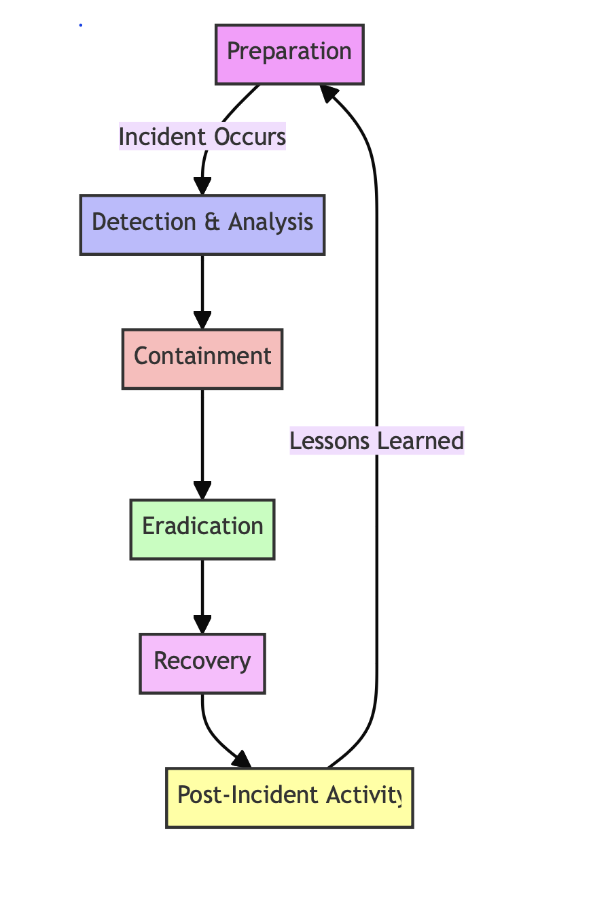
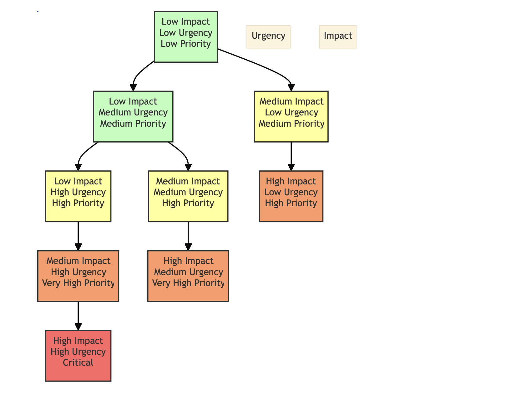
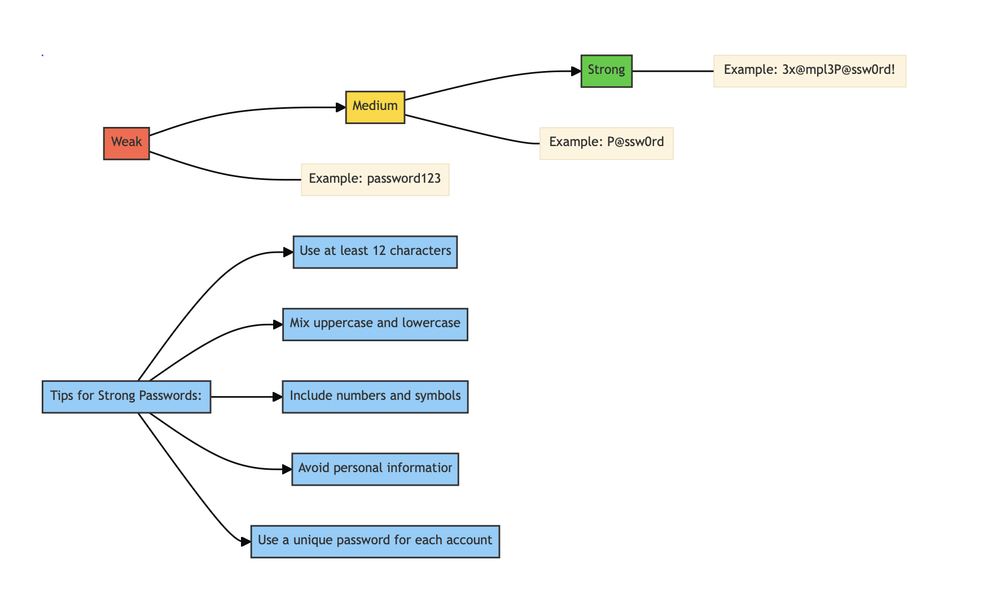
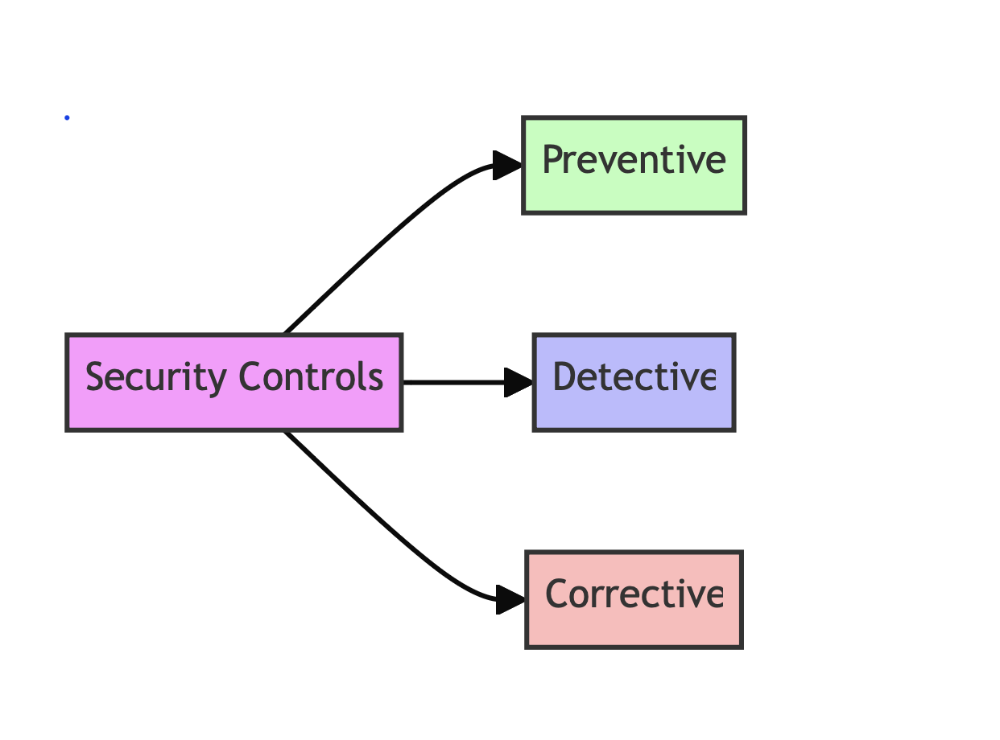

# Cybersecurity Graphics Guide for Templates

This guide outlines suggested graphics to enhance our cybersecurity templates. These visuals will help make complex concepts more accessible and engaging for small businesses.

## 1. Incident Response Plan Graphics

### 1.1 Incident Response Lifecycle Diagram
- A circular diagram showing the stages of incident response:
  1. Preparation
  2. Detection & Analysis
  3. Containment
  4. Eradication
  5. Recovery
  6. Post-Incident Activity
- Use different colors for each stage
- Add brief descriptions or icons for each stage

### 1.2 Incident Severity Matrix
- A 3x3 or 4x4 grid
- X-axis: Impact (Low to High)
- Y-axis: Urgency (Low to High)
- Each cell color-coded (e.g., green for low severity, red for high)
- Brief descriptions in each cell (e.g., "Low Priority", "Critical")

### 1.3 Incident Response Team Structure
- An organizational chart showing the structure of the incident response team
- Include roles like Incident Commander, Technical Lead, Communications Lead, etc.
- Use icons to represent each role
- Show reporting lines and key responsibilities

## 2. Acceptable Use Policy Graphics

### 2.1 Do's and Don'ts Infographic
- Two columns: "Do" (green) and "Don't" (red)
- Use icons to represent different activities (e.g., lock icon for "Do use strong passwords", open padlock for "Don't share passwords")
- Brief, clear text descriptions next to each icon

### 2.2 Data Classification Levels
- A pyramid or tiered structure showing data classification levels
- E.g., Public (bottom), Internal, Confidential, Highly Confidential (top)
- Color code each level (e.g., green for public, red for highly confidential)
- Include brief descriptions or examples for each level

### 2.3 Password Strength Meter
- A horizontal bar showing password strength
- Gradient from red (weak) to green (strong)
- Include examples of weak, medium, and strong passwords
- Add tips for creating strong passwords

## 3. Risk Assessment Template Graphics

### 3.1 Risk Heat Map
- A 5x5 grid
- X-axis: Impact (Very Low to Very High)
- Y-axis: Likelihood (Very Low to Very High)
- Color gradient from green (low risk) to red (high risk)
- Option to plot specific risks as dots on the map

### 3.2 Risk Assessment Process Flowchart
- A flowchart showing the steps of the risk assessment process:
  1. Identify Assets
  2. Identify Threats
  3. Identify Vulnerabilities
  4. Analyze Controls
  5. Determine Likelihood
  6. Analyze Impact
  7. Determine Risk Level
  8. Recommend Controls
- Use shapes and colors to distinguish between steps
- Add brief descriptions for each step

### 3.3 Control Types Diagram
- A Venn diagram or segmented circle showing different types of controls:
  - Preventive
  - Detective
  - Corrective
- Use different colors for each type
- Include examples of each control type

### 3.4 Asset Value vs. Protection Cost Graph
- X-axis: Asset Value
- Y-axis: Cost of Protection
- Plot various assets as points on the graph
- Include a diagonal line representing balanced cost-benefit
- Color code or use different shapes for different asset types